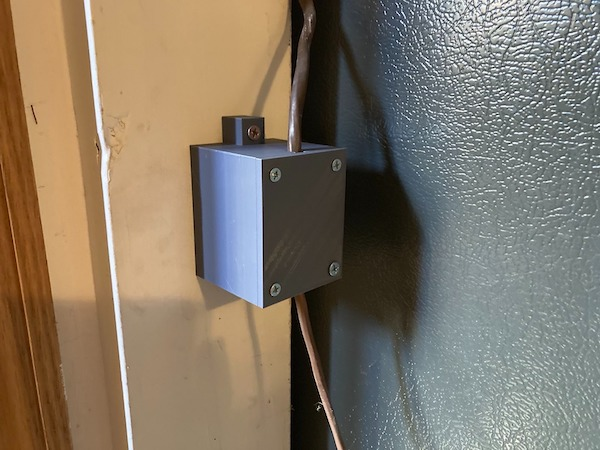

# 3d-electrical-box
3D printable wall-mounted box for hiding unsightly HVAC control wires.

### Render

### Reality

## Description

### Background

From the very first moment I toured the house in which I currently live, I was annoyed by the eyesore that was the rat's nest of electrical twist ties holding together the HVAC system's low-voltage control lines.  They were presumably the result of the addition of a humidifier and UV filter to the ducting lines _after_ it had been initially installed, and were quite literally patched into the pre-existing electrical system.

While this installation may have technically been to code, I deemed it undesirable especially in light of the fact that I'd removed both the humidifier as well as the UV filter which had both stopped functioning.  After having removed the extraneous wiring I decided to tidy up the wiring further by tucking it away in a custom electrical box.  Which is precisely what this project consists of: a wall-mounted, 3D printed electrical box* custom-fit to my particular requirements.

_(*Note that this box would likely not be to code for any high-voltage or high-powered electrical applications.  Responsibility will not be taken for any property or bodily harm resulting from the use of this box.  Seek the advice of a professional electrician before attempting any DIY electrical renovations.)_

### Files

- FreeCAD Models
    1. [wall-box.FCSTD](./FreeCAD_Models/wall-box.FCSTD)
        - Both the box as well as the lid.
- Print-ready STL Models
    1. [wall-box](./STLs/wall-box.stl)
        - The box without the lid.
    2. [wall-box-lid](./STLs/wall-box-lid.stl)
        - The lid without the box.

### Print Settings

- Printer
    - Creality Ender 3 V2 w/0.4mm Nozzle
- Material
    - Monoprice PLA
- Settings
    - 0.2mm Layer Height
    - 20% Infill
    - No Additional Adhesion